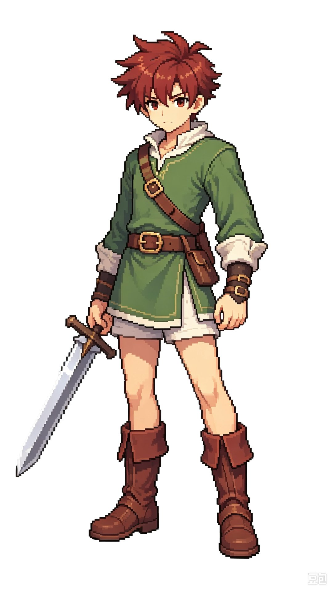
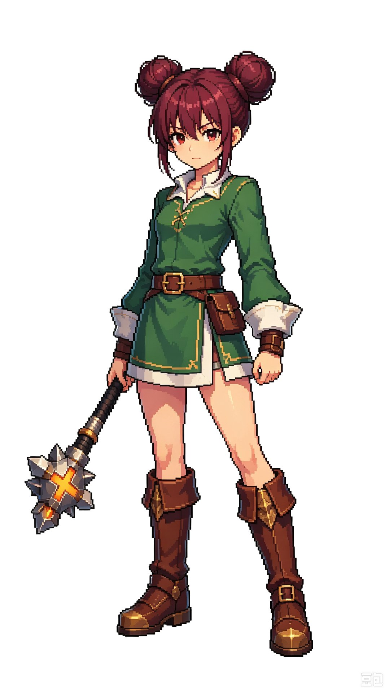
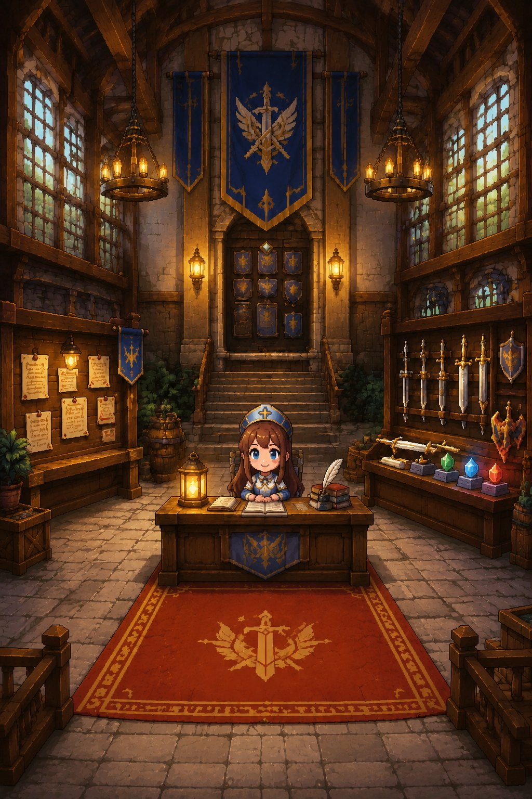

# 日志 #1 · 方案是磨出来的：想了很久，跟 AI 吵了几天

> 发布窗口：**9/24–9/28**　标签：#聚光灯gamejam开发者日志
> 每篇至少 1 张开发过程截图或短视频；与上一篇间隔 ≥2 天。

---

#### 正文

起点挺俗的。我手残，操作类的游戏一直玩不来；坐地铁公交的时候一只手还得扶着，另一只手想玩点什么，自然也不想操作太繁琐。

所以最开始就定了两条：竖屏，单手能玩，别让我一直点。

### 玩法

自动战斗是这么来的。既然定了单手能玩，再要求玩家全程点技能就自相矛盾了。操作交出去以后玩家还剩什么？让他做决定就行，别让他做动作。

一共八个章节，一个章节十层，每层的玩法都不一样：打怪、精英、开宝箱、逛商店、撞事件，最后一层是 Boss。进去之前挑武器、插符石、雇两个佣兵，装备按尺寸占格往背包里塞；进去以后选路线，是继续往下还是撤。撤离跟打赢一样算完。

### 引擎和怎么做

引擎用的团结。我以前只用过 Unity，这次选它主要看中两点：一是它对中国渠道这块优化得比较到位，做小游戏省事不少；二是同源，从 Unity 转过来基本不用重新学。

竖屏 720×1280，纯单机不联网，数值和掉落全走配置表，改个数不用碰代码。

### 美术风格

像素。买了三套正版素材包：SPUM 做角色拼装，Pixel Craft VFX 做特效，物品图标用微元素那套。剩下的背景和立绘交给 AI 出，图个快，省下的时间拿去调玩法。

规格也先定死了：画布 720×1280，原画两倍出图运行时缩一半，一个场景 32 色，按钮不小于 88×88。

风格大概长这样：

男主。红头发，绿衣配金色滚边，棕靴，手里一把剑。身上颜色不杂，靠金边提亮，放大到手机上也看得清。

女主。同一套配色，双丸子头，武器换成锤。两个人摆一起，一眼能看出是一个队伍的。

公会大厅。木梁加石墙，蓝金旗帜配红地毯，吊灯打的暖光。这是玩家进游戏第一眼看到的地方，得让人立刻明白这是个冒险者公会，不是别的什么店。

### 跟 AI 怎么分工

吵了好几天才磨出来的，最后基本固定成这样：

- 方案我出，图它出
- 架构和规则我来定，代码它写
- 世界观我搭架子，它负责往下细化
- 我来测，它负责改 bug

听着挺顺，实际上每一条都得来回磨好几轮。

### 剧情

世界叫埃索斯，古语里是"从伤口呼吸的土地"。神兽被封在地底，那道伤口一直没长好，就成了裂缝，越往深处越危险。玩家是公会的见习生，青梅竹马艾丽娅进了最大的那道裂缝后没了消息。

八个章节各有各的主题：森林、墓园、雨林、海岛、草原、洞穴、熔岩、雪原。

先这样，做出来再说。

#### 配图清单

1. 【待填：截图】最早的策划草稿或文档目录——要能看出改过几版
2. 【待填：截图】美术规格那几条（画布 / 色板 / 点击区 / 安全区）

> 男主 / 女主 / 公会大厅这三张已经在正文里用掉了（`images/` 目录）。
> 发帖时这三张要按平台要求重新上传一遍，md 里的本地路径在 TapTap 帖子里不会自动带上。
