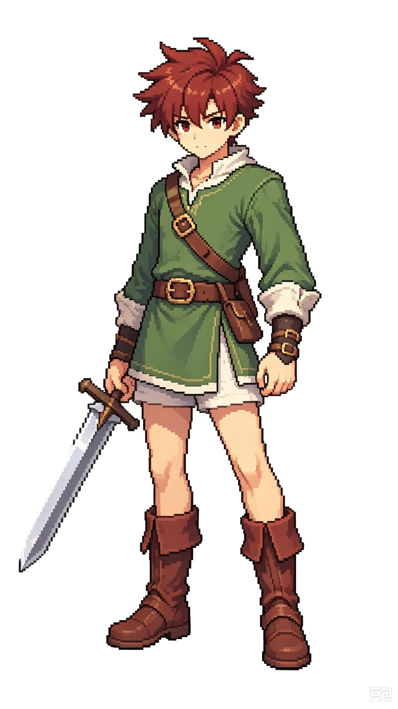
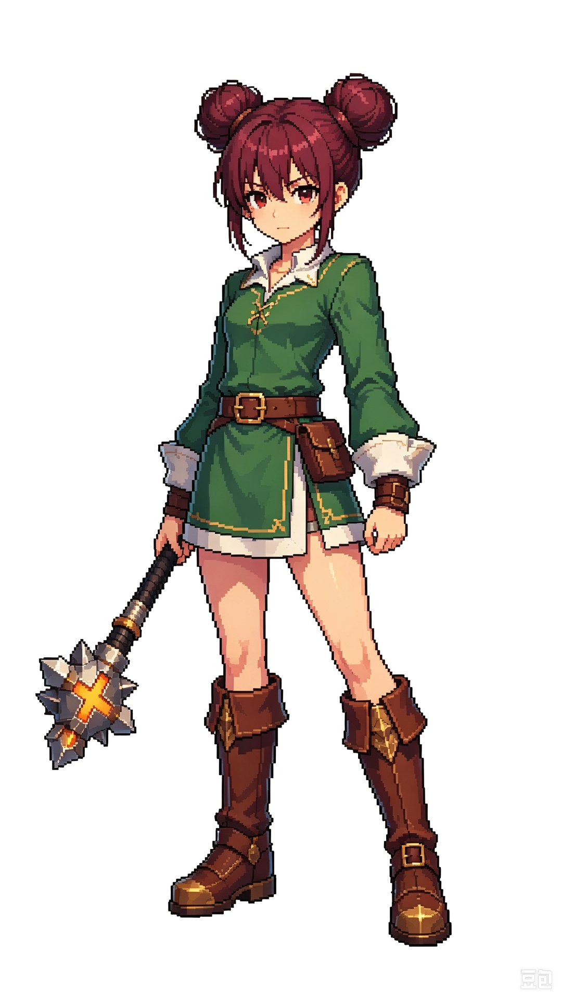
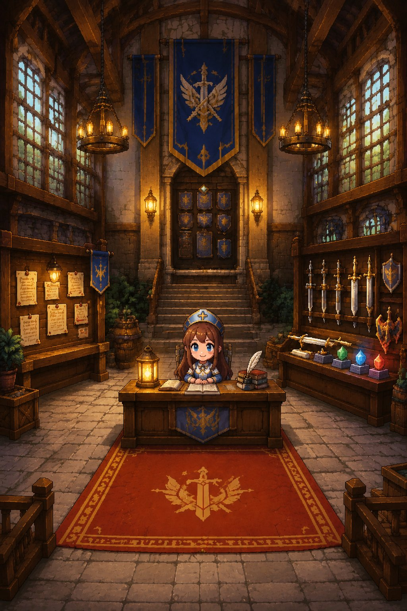

# 日志 #1 · 方案是磨出来的：想了很久，也推翻了很多

> 发布窗口：**9/24–9/28**　标签：#聚光灯gamejam开发者日志
> 与上一篇间隔 ≥2 天；至少 1 张开发过程截图或短视频。

---

#### 正文

起点挺俗的。我手残，操作类的游戏一直玩不来；坐地铁公交的时候一只手还得扶着，另一只手想玩点什么，自然也不想操作太繁琐。

所以最开始就定了两条：竖屏，单手能玩，别让我一直点。

### 玩法

自动战斗是这么来的。既然定了单手能玩，再要求玩家全程点技能就自相矛盾了。操作交出去以后玩家还剩什么？让他做决定就行，别让他做动作。

一共八个章节，一个章节十层，每层的玩法都不一样：打怪、精英、开宝箱、逛商店、撞事件，最后一层是 Boss。进去之前挑职业和武器；进每一层都得先花抽奖币买一次构筑——佣兵、技能、装备里出一样，买到什么，这一局就往什么方向凑。进去以后选路线，是继续往下还是撤。撤离跟打赢一样算完。

（这套是后来才定下来的。最早我写的是"进副本前雇好佣兵、装备掉地上自己捡"，做出来跑了两天就觉得不对——那样构筑在开打之前就锁死了，局内没有决策。于是整个推翻，改成局内抽。怎么抽的、改了几版，我单独写了一篇。）

### 引擎和怎么做

引擎用的团结。我以前只用过 Unity，这次选它主要看中两点：一是它对中国渠道这块优化得比较到位，做小游戏省事不少；二是同源，从 Unity 转过来基本不用重新学。

竖屏 720×1280，纯单机不联网，数值和掉落全走配置表，改个数不用碰代码。

### 美术风格

像素。主体是三套正版素材包：SPUM 做角色拼装，Pixel Craft VFX 做特效，物品图标用微元素那套。剩下缺的背景和立绘，能凑的从素材里凑，凑不出来的自己出图，图个快——省下来的时间我全拿去调玩法了。

规格也先定死了：画布 720×1280，原画两倍出图运行时缩一半，一个场景 32 色，按钮不小于 88×88。

风格大概长这样：

男主。红头发，绿衣配金色滚边，棕靴，手里一把剑。身上颜色不杂，靠金边提亮，放大到手机上也看得清。

女主。同一套配色，双丸子头，武器换成锤。两个人摆一起，一眼能看出是一个队伍的。

公会大厅。木梁加石墙，蓝金旗帜配红地毯，吊灯打的暖光。这是玩家进游戏第一眼看到的地方，得让人立刻明白这是个冒险者公会，不是别的什么店。

### 怎么干活

分工很简单：**方案我自己定，写完自己测，测出来不好玩就推翻重来。**

想法本身不值钱。这个月我推翻的东西比留下的多——抽奖一共做了四版，只留下最后一版；调了几天的怪量区间整条重排；排好的瘦身方案，实测三条里两条是空操作。每一次都是自己做的东西，也都是自己砍的。判断标准只有一条：跑起来那一刻，它好不好玩。

### 剧情

世界叫埃索斯，古语里是"从伤口呼吸的土地"。神兽被封在地底，那道伤口一直没长好，就成了裂缝，越往深处越危险。玩家是公会的见习生，青梅竹马艾丽娅进了最大的那道裂缝后没了消息。

八个章节各有各的主题：森林、墓园、雨林、海岛、草原、洞穴、熔岩、雪原。

先这样，做出来再说。

#### 配图

随便挑，有就行：最早的策划草稿或文档目录（能看出改过几版）、美术规格那几条（画布 / 色板 / 点击区 / 安全区）、或者直接用上面那三张立绘和公会大厅。

> 官方只卡一条：**每篇至少 1 张开发过程截图或短视频**，纯宣传用的海报封面不算。别空手发。
> 男主 / 女主 / 公会大厅在 `images/` 目录里，发帖时要按平台要求重新上传一遍——md 里的本地路径在帖子里不会自动带上。
